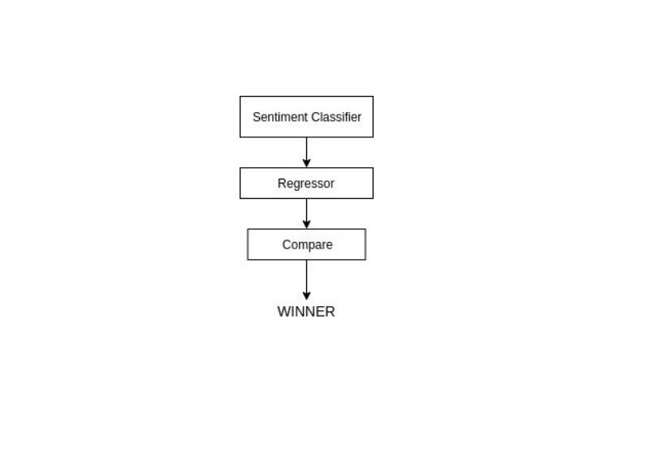

# Sentiment Analysis of Twitter Data for Poll Prediction
Based on data from Twitter, we predict the results of the 2019 Lok Sabha Elections.

## Steps

#### Data Collection
The Twitter Developer platform's Search API was used to collect the tweets. The tweets had to be originated from Indian citizens located within India. Twitter data for two parties - namely BJP (Bharatiya Janata Party) and Congress (Indian National Congress) were collected.

#### Data Processing
The collected raw data was transformed into an understandable format, and stored in CSV files. It included the following steps:
- Data Cleaning - This process included filling in missing
values, smoothing the noisy data (all the tweets were stripped
off special characters like ‘@’ and URLs to overcome noise),
resolving inconsistencies in data.
- Data Integration - Data with different representation are
put together and conflicts were resolved.
- Data Transformation and reduction - Data is normalized,
aggregated and generalized. Then it is represented in a
reduced form and stored in DataSet.

#### Data Labeling
Vader (Valence Aware Dictionary and Sentiment Reasoner) is a lexicon and rule-based sentiment analysis tool that is specifically attuned to sentiments expressed in social media. It is basically a sentiment intensity polarizer.
Vader takes a sentence as input and provides a percent value for three categories - positive, neutral, negative and compound (overall polarity of the sentence).

#### Creating Training Set
The Dataset for 2014 Elections was used to create training dataset. From the State Wise Result of 2014 Elections,
date related to Total valid votes polled in states and Total valid votes polled by parties was collected and was integrated with the twitter dataset.

#### Design
The proposed model can be divided into 3 main stages on the basis of the nature of the task to be performed.

Sentiment Analysis phase involves attributing the data with its associated polarity value. 
Final data set created after sentiment analysis and data labeling is fed into a regressor. The regressor is trained on the data collected for General Elections of 2014 and then is used to predict the results of 2019 elections.

Finally, the accuracy of the regression model is measured and results are compared.
